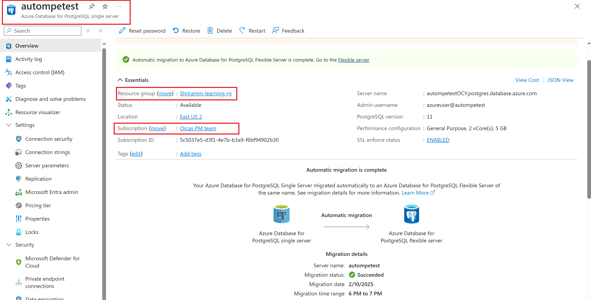
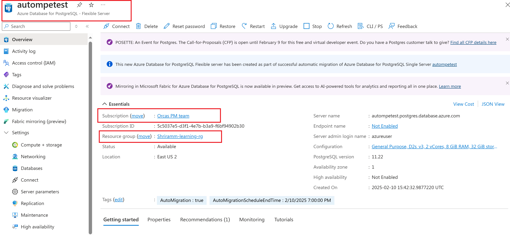
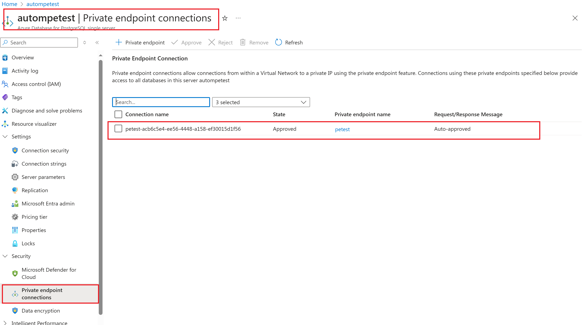
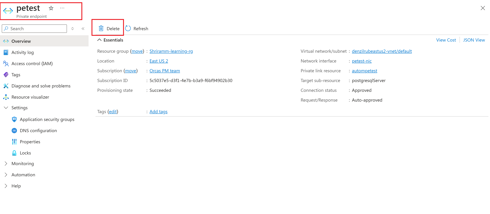
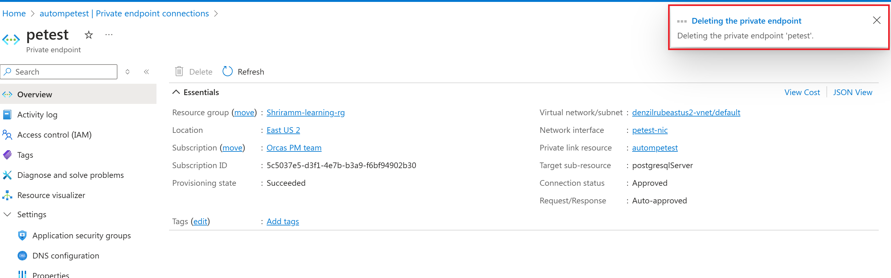
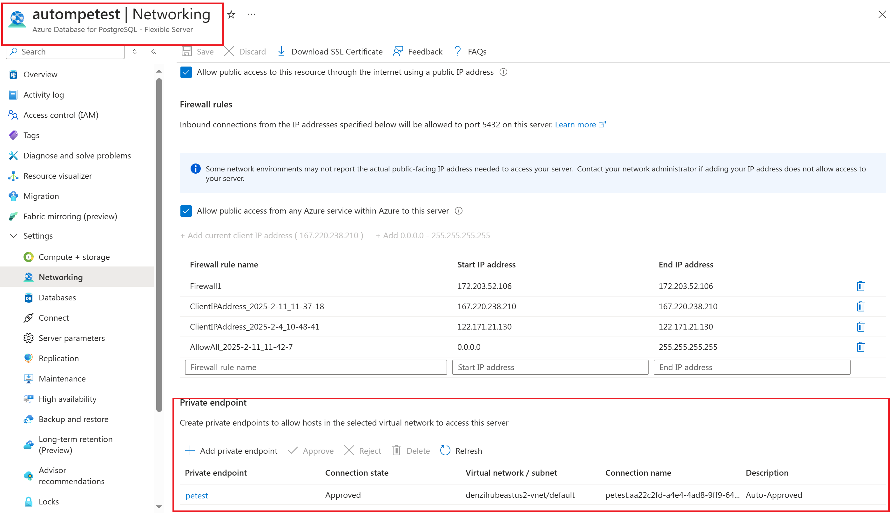
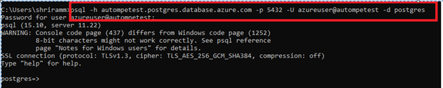

# Automigrations of PostgreSQL Single Servers with Private End Points

Automigration is a service-initiated migration that occurs during a planned maintenance window for a single server. After the migration, a flexible server is created with the same name as the original single server, with all data copied over. Additionally, existing connection strings used for the single server will automatically point to the newly migrated flexible server. [Learn More](https://learn.microsoft.com/azure/postgresql/migrate/automigration-single-to-flexible-postgresql)

## Optins/Nominations

**The service does not automatically pick up single servers with private endpoints for automigration before the Single Server end-of-life (March 28, 2025)**. However, we have received multiple customer requests [to opt in for automigration](https://forms.office.com/pages/responsepage.aspx?id=v4j5cvGGr0GRqy180BHbR9vSJb1bkhhKmltKOz3cZ0tUQTBLUU42TkxZRkY3SFhXRDQ5WUoyWk5QVS4u&route=shorturl) due to the following reasons:
 -  Eliminating the overhead of performing the migration manually.
 -  Maintaining connection string compatibility between single and flexible servers to minimize application code changes. 

This document provides step-by-step guidance for customers who have opted in for the automigration of their single server with a private endpoint. 

## Challenges with private end point 

Automigration is carried out using the [Azure PostgreSQL Migration Service](https://learn.microsoft.com/azure/postgresql/migrate/migration-service/overview-migration-service-postgresql). However, the service does not copy private endpoints, read replicas, or any other settings that would result in the creation of new Azure resources. Since the migration service requires explicit customer consent before creating resources on their behalf—and automigration does not involve such consent, it is unable to migrate private endpoints from a single server to a flexible server. 

For automigrated single servers with private endpoints, customers must manually configure private endpoints on the migrated flexible server to maintain business continuity. 

## Steps to configure Private End Points for an Automigrated Flexible Server 

- Confirm that Flexible server with the same name as single server exists in the same subscription and resource group. This indicates that the automigration was successful. (Refer to the attached screenshots from Azure portal for reference). 

- Delete the private end point associated with the Single Server using [Azure CLI](https://learn.microsoft.com/cli/azure/postgres/server/private-endpoint-connection?view=azure-cli-latest#az-postgres-server-private-endpoint-connection-delete) or by following steps in Azure portal.

- Create a private end point on the auto migrated Flexible server, using the same name as the one from single server using [Azure CLI](https://learn.microsoft.com/azure/postgresql/flexible-server/how-to-networking-servers-deployed-public-access-add-private-endpoint?tabs=cli-add-private-endpoint-connection) or [Azure portal](https://learn.microsoft.com/azure/postgresql/flexible-server/how-to-networking-servers-deployed-public-access-add-private-endpoint?tabs=portal-add-private-endpoint-connections).

- Make sure to use the same Private DNS zone that was used on the Single Server private end point. [Learn More](https://learn.microsoft.com/en-us/azure/postgresql/flexible-server/concepts-networking-private-link#private-link-and-dns)

- Ensure that the deployment completes successfully and that the private end point is attached to the Flexible server.

- After configuration, you should be able to connect to automigrated flexible server using the same connection strings as single server via the private end point. 

